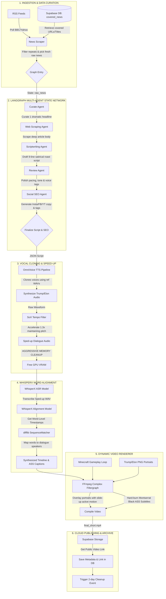

# 🎙️ Yap Report: Automated Comedic News Short Generator 🤖📺

[](https://fastapi.tiangolo.com)
[](https://github.com/langchain-ai/langgraph)
[](https://github.com/k2-fsa/OmniVoice)
[](https://github.com/m-bain/whisperX)
[](https://www.docker.com)
[](https://supabase.com)

**Yap Report** is an advanced, fully-automated media production pipeline that turns standard RSS daily headlines into high-octane, brainrot-infused, vertical short-form videos (TikTok/Reels/Shorts). The video features a dynamic, highly authentic satirical verbal roast battle between custom AI voice clones of **Donald Trump** and **Elon Musk** commenting on the news. 

Every single step—from daily news curation, webpage content scraping, comedic dialogue scripting, multi-speaker voice synthesis, GPU-accelerated word-level subtitle alignment, dynamic video motion overlays, and multi-platform SEO caption generation—is completely automated and orchestrated via a structured **LangGraph** multi-agent state network.

---

## 🗺️ System Architecture

The following diagram illustrates the lifecycle of a single video generation, tracing the data flow from RSS feeds down to cloud storage and database synchronization.



---

## ⚡ Core Features & Deep Dive

### 1. LangGraph Multi-Agent Orchestration
The logical brain of the project resides in a `StateGraph` which manages a robust JSON pipeline of agents driven by Gemini (leveraging `gemini-3.5-flash` with redundant fallbacks to `gemini-3.1-flash-lite` and dual-API key configurations to avoid service interruptions):
*   **Curator Agent (`CuratedStory`):** Evaluates raw daily articles. Uses historical metadata in Supabase to skip previously generated content, ensuring a fresh feed, and picks the most explosive geopolitical or tech storyline.
*   **Scraping Agent:** Standardizes headers to scrape the target article up to 4000 characters using `BeautifulSoup4`.
*   **Comedic Scriptwriter (`Script`):** Translates article context into a verbal battleground. It forces a strict **9-line rapid pacing format** alternating between speaker voices (Trump and Elon), embeds vocal humanized fillers (`[laughter]`, `[sigh]`), and caps the video with a ridiculous, high-stakes physical call-to-action threat (e.g., *"Follow Yap Report OR your neuralink will auto-subscribe you to organic wheat farming tutorials"*).
*   **Review Agent:** Rewrites flatter draft segments to maximize visual retention, audio tag timing, and character voice authenticity.
*   **Social SEO Agent (`SocialMetadata`):** Concurrently drafts optimized descriptions. Instagram captions are loaded with keywords; Facebook posts are strictly length-capped to **255 characters** with mandatory `#reel` tags; YouTube Shorts titles are kept under **70 characters** for maximum click-through rates.

### 2. Voice Cloning (OmniVoice) & Audio Engineering (SoX)
*   **Zero-Shot Clone:** Automatically routes text segments to the custom zero-shot model `k2-fsa/OmniVoice`. Synthesizes natural-sounding speech from reference audio clips (`assets/trump new fast.wav` and `assets/elon new fast.wav`).
*   **VRAM Allocation Management:** Voice models and transcribers are extremely VRAM-intensive. The pipeline features an aggressive PyTorch release mechanism (`_unload_model`). It moves weights off the GPU, deletes reference tags, triggers garbage collection, and flushes the CUDA cache before loading WhisperX, preventing CUDA Out-Of-Memory (OOM) failures even on smaller commercial GPUs.
*   **Pacing Optimization:** Since raw AI audio can sound slow, SoX (Sound eXchange) accelerates the compiled waveform by **1.3x** using the `tempo` filter, compression, and sample rates. This increases speed without modifying the vocal pitch, giving it a hyper-energetic short-form video pacing.

### 3. Word-Level Alignment (WhisperX & SequenceMatcher)
Traditional transcription relies on segment-level subtitles, which are sluggish. Yap Report achieves high-retention 1-word-per-frame popping captions:
*   **Transcription:** Sped-up audio is fed into a `large-v3` WhisperX alignment network.
*   **Fuzzy Token Diffing:** Whisper can sometimes mishear words. The pipeline implements a unique text alignment algorithm using **`difflib.SequenceMatcher`**. It matches Whisper's raw transcription output against the original generated script tokens, identifying global matching blocks and bypassing mumbling or skipped lines.
*   **Speaker Mapping:** A forward/backward filler pass applies precise speaker assignments to every single word in the transcript based on its matched index, ensuring correct character portraits activate on screen.

### 4. FFmpeg Complex Filtergraph Motion Renderer
Yap Report compiles high-quality **1080x1920 @ 30FPS** vertical videos directly via FFmpeg without needing heavy visual editing tools like Premiere or After Effects:
*   **Subtitles (ASS Styling):** Subtitles are written into an Advanced SubStation Alpha (`.ass`) file with custom properties:
    *   Font: **Montserrat Black** (automatically downloaded from GitHub on first launch).
    *   Sizing: 95pt positioned higher up (`MarginV: 900`) to clear portrait overlays.
    *   Highlighting: Rapid-fire `WORDS_PER_CAP = 1` timing where the currently spoken word turns **bright yellow** (`&H0000FFFF&`) with custom `border 8` and `shadow 5` to stand out against bright backgrounds.
*   **Dynamic Pop-Up Animations:** Character portraits slide onto the screen when active and slide off when quiet. We accomplish this entirely within FFmpeg's CLI using math expressions:
    $$\text{y} = \text{base\_y} + \max\left(0, \text{slide\_distance} \times \left(1 - \frac{t - t_{\text{start}}}{\text{duration}}\right)\right)$$
    This formula is compiled into a giant nested conditional expression (`if(between(t, start, end), active_y, inactive_y)`) for every turn in the script, causing the portraits to bounce up elegantly in 0.15 seconds whenever they begin to speak.
*   **Hardware Encoding:** The video generator automatically detects NVIDIA NVENC support (`h264_nvenc`) to offload processing to GPU hardware with custom optimized bitrates, falling back to CPU (`libx264`) if unavailable.

---

## 🛠️ Installation & Setup

### Prerequisites
1.  **Python 3.11** installed.
2.  **FFmpeg** and **SoX** must be installed and added to your system's PATH.
    *   **Windows (Chocolatey):**
        ```powershell
        choco install ffmpeg-full sox
        ```
    *   **Ubuntu/Debian:**
        ```bash
        sudo apt update && sudo apt install -y ffmpeg sox libsox-fmt-all
        ```
3.  **CUDA-Compatible GPU (Recommended):** CUDA Toolkit 12.1+ is highly recommended for optimal synthesis and alignment speeds.

### Local Setup
1.  **Clone the Repository:**
    ```bash
    git clone https://github.com/smit-faldu/yapreport.git
    cd yapreport
    ```
2.  **Initialize Virtual Environment:**
    ```bash
    python -m venv .venv
    # On Windows:
    .venv\Scripts\activate
    # On Linux/macOS:
    source .venv/bin/activate
    ```
3.  **Install PyTorch (CUDA-optimized if applicable):**
    ```bash
    pip install torch torchvision torchaudio --index-url https://download.pytorch.org/whl/cu121
    ```
4.  **Install Python Dependencies:**
    ```bash
    pip install -r requirements.txt
    ```
5.  **Place Assets:**
    Ensure you place the following files inside the `assets/` directory:
    *   `assets/minecraft_loop.mp4`: The looping background video.
    *   `assets/trump.png` & `assets/elon.png`: High-resolution headshots with transparent backgrounds.
    *   `assets/trump new fast.wav` & `assets/elon new fast.wav`: Reference audio files for zero-shot cloning.

---

## 🔐 Environment Variables (`.env`)

Create a `.env` file in the root folder of the project. A template of required values is shown below:

```ini
# --- LLM API KEYS ---
# Primary Google Gemini API key
GOOGLE_API_KEY="your-google-api-key"
# Secondary backup key (optional, for failover safety)
GEMINI_API_KEY_SECONDARY="your-backup-gemini-key"

# --- SUPABASE INTEGRATION ---
# Supabase URL endpoint
SUPABASE_URL="https://your-project-id.supabase.co"
# Supabase API key (service role recommended for writing data)
SUPABASE_KEY="your-supabase-api-key"
# Storage bucket name for video uploads (defaults to 'videos')
SUPABASE_BUCKET="videos"
```

### Supabase DB Schema
To use the duplicate news filtration and metadata tracking, ensure your Supabase database has a table named `covered_news` with the following columns:

```sql
CREATE TABLE covered_news (
    id BIGSERIAL PRIMARY KEY,
    created_at TIMESTAMP WITH TIME ZONE DEFAULT timezone('utc'::text, now()) NOT NULL,
    url TEXT UNIQUE NOT NULL,
    title TEXT NOT NULL,
    video_link TEXT,
    social_metadata JSONB
);
```

---

## 🚀 Running the Application

Yap Report operates as an API server powered by **FastAPI** and **Uvicorn**, enabling easy remote triggering or integration with cron schedules and automation tools like n8n or Zapier.

### Start the Server
```bash
python src/main.py
```
By default, the server runs on `http://localhost:8000`.

### API Endpoints

#### 1. Server Health Check
*   **Method:** `GET`
*   **Path:** `/`
*   **Response:**
    ```json
    {
      "status": "ok",
      "message": "Server is up and running"
    }
    ```

#### 2. Trigger Async Generation (Recommended for webhooks/queues)
*   **Method:** `POST`
*   **Path:** `/generate`
*   **Response:** Starts the pipeline in a background thread and returns immediately. Excellent for avoiding request timeouts.
    ```json
    {
      "status": "accepted",
      "message": "Pipeline execution started in the background. Check server logs for the final Supabase URL."
    }
    ```

#### 3. Trigger Synchronous Generation
*   **Method:** `GET`
*   **Path:** `/generate-sync`
*   **Response:** Waits for the entire rendering pipeline to finish (may take 1-3 minutes depending on GPU hardware) and returns the completed Supabase upload URL and SEO copy:
    ```json
    {
      "status": "success",
      "message": "Pipeline execution completed successfully",
      "video_url": "https://your-project.supabase.co/storage/v1/object/public/videos/yapreport_1717154245.mp4",
      "social_metadata": {
        "instagram_caption": "Trump and Elon get HEATED over the latest AI regulation bill! 😂...",
        "facebook_caption": "Trump and Elon get HEATED over AI! #reel #reels #news",
        "youtube_title": "Trump & Elon ROAST New Tech Laws!",
        "youtube_description": "Donald Trump and Elon Musk discuss the crazy new technical regulations...",
        "tags": ["trump", "elon musk", "yap report", "news comedy", "satire"]
      }
    }
    ```

---

## 📦 Project Structure

```text
yapreport/
├── assets/                     # Media resources
│   ├── elon new fast.wav       # Elon voice reference WAV
│   ├── elon.png                # Elon headshot
│   ├── minecraft_loop.mp4      # Background loop
│   ├── trump new fast.wav      # Trump voice reference WAV
│   └── trump.png               # Trump headshot
├── src/
│   ├── agents/
│   │   ├── __init__.py
│   │   └── script_agent.py     # LangGraph agent definitions & logic
│   ├── models/
│   │   ├── __init__.py
│   │   └── schemas.py          # State types & Pydantic models
│   ├── services/
│   │   ├── __init__.py
│   │   ├── news_scraper.py      # RSS feed parsing & web scrapers
│   │   ├── supabase_uploader.py # Supabase storage & DB controllers
│   │   ├── transcriber.py      # WhisperX audio transcribing
│   │   └── tts_service.py      # OmniVoice clone & SoX accelerator
│   ├── video/
│   │   ├── __init__.py
│   │   ├── muxer.py            # Temporary sound & video muxers
│   │   └── renderer.py         # FFmpeg filtergraphs & ASS subtitles
│   ├── config.py               # Constants, dimensions & paths
│   └── main.py                 # FastAPI application routes
├── .env                        # Configuration environment keys
├── Dockerfile                  # Production container definition
├── requirements.txt            # Python requirements manifest
└── README.md                   # This documentation file
```

---

## 🐳 Docker Deployment

The application includes an optimized, multi-layer cached Dockerfile containing both system dependencies (`ffmpeg`, `sox`, `git`) and the Python modules.

### 1. Build the Docker Image
```bash
docker build -t yapreport:latest .
```

### 2. Run the Container
Pass your environment file to the container:
```bash
docker run -d \
  -p 8000:8000 \
  --env-file .env \
  --name yapreport \
  yapreport:latest
```

*Note: For GPU acceleration inside Docker, ensure you have the **NVIDIA Container Toolkit** installed and pass the `--gpus all` flag to the `docker run` command.*

---

## 🛡️ License

This project is licensed under the MIT License. See the [LICENSE](LICENSE) file for more information.

---

<p align="center">
  <b>Developed for smit-faldu/yapreport. Follow Yap Report or your microwave will start reading political speeches in the middle of the night! 🎚️🎙️</b>
</p>
